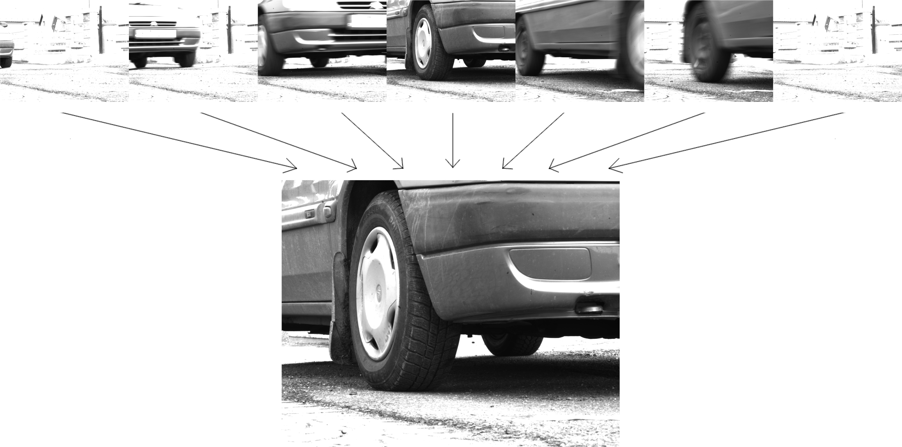

treadscan.detector
==================

Detector
--------

.. autoclass:: treadscan.detector.Detector
   :members:

InputType
---------

.. autoclass:: treadscan.detector.InputType
   :members:

FrameExtractor
--------------

.. autoclass:: treadscan.detector.FrameExtractor
   :members:
