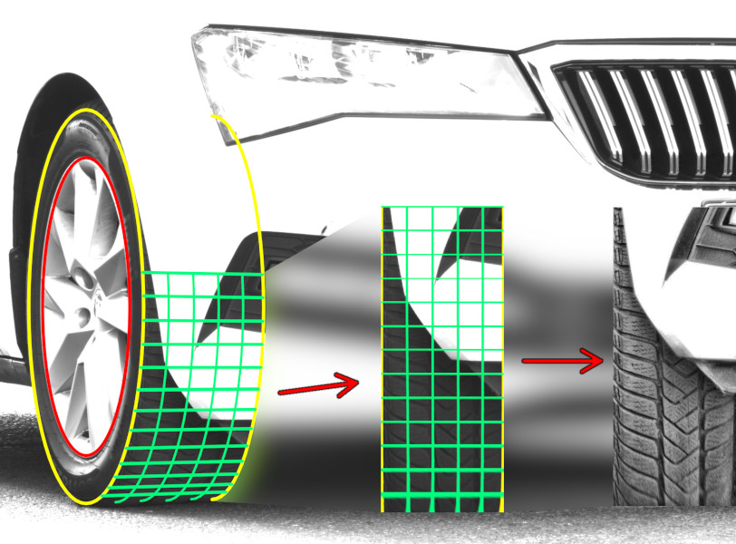

.. treadscan documentation master file, created by
   sphinx-quickstart on Fri Feb  4 14:01:31 2022.
   You can adapt this file completely to your liking, but it should at least
   contain the root `toctree` directive.

Treadscan documentation
=======================

Required Python version: ``python3.8`` or higher.

Required packages: ``numpy>=1.22.1``, ``opencv-contrib-python>=4.5.5.62``, ``improutils>=1.1.8``.

To build this documentation, you need ``Sphinx>=4.4.0``, ``numpydoc>=1.2`` and ``sphinx-rtd-theme=>1.0.0``.

**Treadscan modules:**

.. autosummary::
   treadscan.detector
   treadscan.segmentor
   treadscan.extractor
   treadscan.utilities

**Treadscan classes:**

.. autosummary::
   treadscan.detector.Detector
   treadscan.detector.InputType
   treadscan.detector.FrameExtractor
   treadscan.segmentor.Segmentor
   treadscan.extractor.Extractor
   treadscan.extractor.CameraPosition
   treadscan.utilities.Ellipse

.. toctree::
   :maxdepth: 2
   :caption: Table of Contents
   :name: mastertoc
   :includehidden:

   detector
   segmentor
   extractor
   utilities

Indices and tables
==================

* :ref:`genindex`
